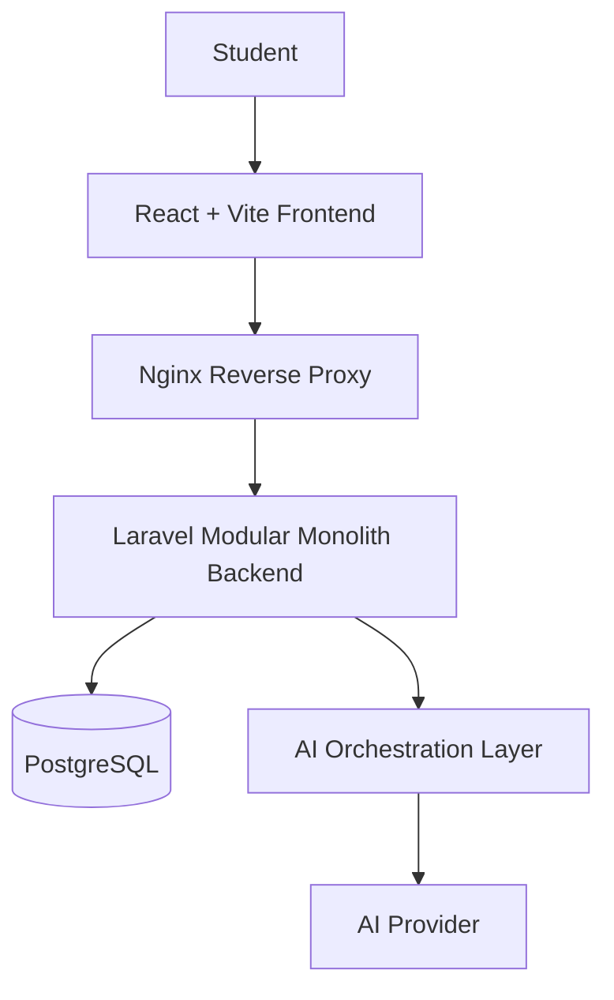

# Re:Learn

**Turn your existing study materials into a personal AI teacher.**

Re:Learn is an AI-powered learning platform that transforms the PDFs, lecture notes, and slides you already have into a structured, interactive study workspace. Instead of rereading the same material and guessing what you actually understand, Re:Learn explains concepts, quizzes you, evaluates your answers, and tracks topic-level mastery — all grounded in your own materials.

---

[Watch the Re:Learn Demo](https://youtu.be/6VwkiUaHL9I?si=7uB4bDE_rDPMF5Sd)

## Overview

Students accumulate a lot of study material — PDFs, lecture notes, and slides — but traditional self-study usually means reading the same content over and over without a clear sense of what has actually been learned. Creating quizzes, summaries, and study plans by hand also takes significant time.

Re:Learn solves this by turning uploaded study materials into an interactive learning workspace built around a simple learning loop:

```
Learn → Test → Evaluate → Review
```

You upload a PDF, Re:Learn extracts and processes it, identifies the topics and subtopics inside it, and makes the material available in your Material Library. From there you can open any material, see an overview of its topics and your progress, and start a study session. During a session, Re:Learn explains concepts, generates quizzes from the material, evaluates your answers with feedback, flags weak topics, and guides you back to what needs more attention.

Re:Learn is built for students who want to revisit material they have already studied — especially before exams or when reviewing a previous semester.

## The Problem

Most self-study is passive. Students reread large documents without knowing whether they have truly understood the content. There is usually no structured way to:

- Know which topics are actually understood and which are not.
- Test understanding with questions derived from the material.
- Get feedback on answers beyond a simple right/wrong check.
- Pick up where they left off in a previous study session.

Manually building quizzes and study plans for each subject is time-consuming and rarely done. The result: students keep reading, but they do not reliably learn.

## The Solution

Re:Learn turns passive study materials into active, structured learning. Upload a document once, and Re:Learn:

- Extracts the text and identifies the topics and subtopics within it.
- Stores the material in a personal Material Library with per-topic progress.
- Runs structured study sessions that combine AI explanations, AI-generated quizzes, and answer evaluation with feedback.
- Tracks mastery per subtopic so students can see — at a glance — what is mastered, what is in progress, and what needs review.
- Recommends revisiting weak topics, closing the Learn → Test → Evaluate → Review loop.

The learning experience is grounded entirely in the user's own uploaded material rather than general knowledge, so sessions stay aligned with the student's actual course content.

## How Re:Learn Works

A typical flow through the product:

1. **Upload Material** — a student uploads a study document such as a PDF.
2. **Process Material** — Re:Learn extracts the text and splits it into manageable chunks.
3. **Identify Topics** — the system identifies the topics and subtopics covered by the material.
4. **Study** — the student opens a study session and selects the topics, learning mode, and difficulty.
5. **Test** — Re:Learn generates quizzes from the material's content.
6. **Evaluate** — answers are evaluated with detailed feedback, and the results update topic mastery.
7. **Review** — weak topics are flagged and the student is guided back to them for targeted review.

Progress is saved, so a student can return to any material later and continue from where they left off.

## Key Features

- **Study material upload** — upload PDFs through a guided upload flow with live processing status.
- **PDF text extraction** — documents are converted to text with `pdftotext` (poppler-utils).
- **Topic and subtopic organization** — each material is automatically structured into topics and subtopics.
- **Material Library** — browse, search, and open previously uploaded materials.
- **Material Detail** — view a material's overview, topics, and mastery progress, and download the original file.
- **Study sessions** — start sessions with four learning modes: **Teach Me**, **Quiz Me**, **Review Weak Topics**, and **Guided Study Session**, at Easy/Medium/Hard difficulty.
- **AI explanations** — ask the AI teacher to explain a concept, simplify it, give an example, or review it.
- **AI-generated quizzes** — quizzes are generated from the material with multiple choice, true/false, and short answer questions.
- **Answer evaluation and feedback** — each answer is evaluated by the AI with feedback and correctness verdict.
- **Topic-level mastery tracking** — mastery is computed per subtopic from quiz history and aggregated per material, with clear statuses: Mastered, In Progress, Needs Review, Not Started.
- **Weak-topic review** — topics that need attention are flagged in the learning map and can be reviewed directly.
- **Accounts and private data** — user registration and login (Laravel Sanctum); every material, session, quiz, and mastery record is scoped to its owner.

## Technical Architecture

Re:Learn is a single-page application backed by a Laravel modular monolith and PostgreSQL, with an in-process AI orchestration layer that keeps application logic independent of any specific AI provider.



### Backend — Modular Monolith

The Laravel backend is organized into focused modules that mirror product concerns: **Materials**, **Processing**, **Topics**, **Study Session**, **Quiz**, and **Learning State**. Modules communicate through in-process service calls inside a single application, which keeps deployment and data consistency simple while preserving clear boundaries between responsibilities.

- **Materials** — Material Library, material detail, and file download.
- **Processing** — coordinates the upload pipeline: text extraction, cleaning, chunking, and topic identification.
- **Topics** — the topic/subtopic tree and its mastery/status data for the learning map.
- **Study Session** — session configuration and coordination of learning modes.
- **Quiz** — quiz generation, persistence, and answer evaluation.
- **Learning State** — deterministic mastery calculation and status thresholds.

### AI Layer — Provider-Agnostic Orchestration

All AI work flows through an in-process `ai_service` (AI Orchestrator). It builds prompts, calls the configured provider through a common **LLM Provider Abstraction**, applies retries and an optional fallback provider, and validates structured output before returning results to application modules.

Providers are selected through environment configuration, never hard-coded:

| Provider | Role |
|---|---|
| **OpenRouter** | Default provider (default route `openrouter/free`) |
| **Featherless.ai** | Optional provider, used when configured |
| **Mock** | Deterministic provider for development and automated testing |

The AI handles four reasoning tasks only — topic/subtopic identification, explanation, quiz generation, and answer evaluation. It never writes to the database and never decides learning state; all persistence and mastery computation happens in Laravel's application modules.

Context retrieval is deliberately simple: relevant content is fetched from PostgreSQL by filtering the stored chunks on `material_id` and the active `topic_id`/`subtopic_id`. There is no vector database.

## AI Pipeline

The journey from uploaded document to study session:

```
PDF Upload
  → Text Extraction (pdftotext)
  → Text Cleaning
  → Chunking (fixed-length, ~1,000 characters with overlap)
  → Topic & Subtopic Identification (AI, structured output)
  → Study Material Structure (topics, subtopics, tagged chunks)
  → Study Session (explanations, quizzes, evaluation, review)
```

Only topic identification is an AI step; extraction, cleaning, and chunking are deterministic application logic. When a student later asks for an explanation or a quiz, the relevant chunks for the selected topic/subtopic are retrieved and passed to the AI so responses stay grounded in the material.

## Tech Stack

| Layer | Technology |
|---|---|
| **Frontend** | React 18, Vite 6, Tailwind CSS 4 |
| **Backend** | Laravel 12, PHP 8.2 (modular monolith) |
| **Database** | PostgreSQL 16 |
| **Web server** | Nginx (reverse proxy) |
| **Document processing** | Poppler-utils (`pdftotext`) via `spatie/pdf-to-text` |
| **AI** | Provider-agnostic orchestration — OpenRouter (default), Featherless.ai (optional), Mock (dev/test) |
| **Infrastructure** | Docker, Docker Compose |

## Project Structure

```
Re:Learn/
├── docker/
│   └── nginx/                 # Nginx configuration and site routing
├── backend/                   # Laravel application (PHP 8.2)
│   ├── app/
│   │   ├── Http/              # Controllers, requests, resources
│   │   ├── Models/            # Eloquent models
│   │   ├── Modules/           # Backend module scaffolding
│   │   ├── Services/
│   │   │   ├── Ai/            # AI orchestration & provider abstraction
│   │   │   ├── Materials/     # Material processing pipeline
│   │   │   ├── Processing/    # PDF extraction, cleaning, chunking
│   │   │   ├── Quizzes/       # Quiz generation & evaluation
│   │   │   └── StudySessions/ # Study session logic
│   │   └── ...
│   ├── config/                # Laravel configuration (incl. ai.php)
│   ├── database/migrations/   # Database schema
│   └── routes/api.php         # REST API routes
├── frontend/                  # React application (Vite + Tailwind)
│   └── src/
│       ├── pages/             # Home, My Materials, Material Detail, Workspace
│       ├── features/          # workspace, materials, auth, home
│       └── ...
├── docker-compose.yml         # Docker Compose configuration
└── .env.example               # Environment variables template
```

## Getting Started

### Prerequisites

- Docker Desktop
- Docker Compose

### 1. Environment Configuration

Copy `.env.example` to `.env` and adjust values if needed:

```bash
cp .env.example .env
```

To use the AI features, set the provider credentials in the backend environment (`.env` in the repo root is mapped into the backend):

```env
AI_PROVIDER=openrouter
AI_MODEL=openrouter/free
OPENROUTER_API_KEY=your_key_here
```

For development without an external API, set `AI_PROVIDER=mock`.

Default ports:

- Nginx: `80`
- Frontend (Vite): `5173`
- Backend (Laravel): `8000`
- PostgreSQL: `5432`

### 2. Build and Start Services

```bash
docker compose build
docker compose up -d
```

### 3. Initialize Laravel

Generate the application key and run migrations:

```bash
docker compose exec backend php artisan key:generate
docker compose exec backend php artisan migrate
```

## Access Points

When the services are running:

| Service | URL |
|---|---|
| **Application (via Nginx)** | http://localhost |
| **Frontend (direct)** | http://localhost:5173 |
| **Backend API (direct)** | http://localhost:8000 |
| **PostgreSQL** | localhost:5432 |

## Docker Services

| Service | Description |
|---|---|
| **postgres** | PostgreSQL 16 database |
| **backend** | Laravel application (PHP 8.2 + poppler-utils) |
| **frontend** | React application (Vite dev server) |
| **nginx** | Reverse proxy routing `/` to the frontend and `/api/*` to the backend |

## Development Workflow

### View logs

```bash
docker compose logs -f                # all services
docker compose logs -f backend        # specific service
```

### Run migrations

```bash
docker compose exec backend php artisan migrate
```

### Composer (backend dependencies)

```bash
docker compose exec backend composer install
docker compose exec backend composer require package/name
```

### npm (frontend dependencies)

```bash
docker compose exec frontend npm install
docker compose exec frontend npm install package-name
docker compose exec frontend npm run build
```

### Database access

```bash
docker compose exec postgres psql -U Re:Learn -d Re:Learn
```

### Restart a service

```bash
docker compose restart backend
```

### Rebuild containers

```bash
docker compose build --no-cache       # rebuild all
docker compose build --no-cache backend
```

### Stop services

```bash
docker compose stop                   # stop, keep containers
docker compose down                   # stop and remove containers
docker compose down -v                # stop and remove containers + volumes
```

Both the frontend (Vite HMR) and backend (Laravel dev server) reload automatically when their source files change.

## PDF Processing

PDF text extraction uses `pdftotext` from poppler-utils, which is installed in the backend Docker image. Verify the tool is available with:

```bash
docker compose exec backend pdftotext -v
```

## Troubleshooting

### Port conflicts

If ports are already in use, change them in `.env`:

```
NGINX_PORT=8080
FRONTEND_PORT=5174
BACKEND_PORT=8001
DB_PORT=5433
```

### Permission issues

If Laravel reports permission errors:

```bash
docker compose exec backend chmod -R 775 storage bootstrap/cache
docker compose exec backend chown -R www-data:www-data storage bootstrap/cache
```

### Database connection issues

Make sure PostgreSQL is healthy and check its logs:

```bash
docker compose ps postgres
docker compose logs postgres
```

### Frontend not updating

Restart the frontend service:

```bash
docker compose restart frontend
```

## Security Notes

- Default credentials are for **local development only**.
- Never commit a real `.env` file with credentials.
- Change all passwords and keys before deploying to production.
- PostgreSQL is not exposed to the public interface by default.

## Hackathon

Re:Learn was built for the **Impact Forge: Summer 2026 Hackathon**.
